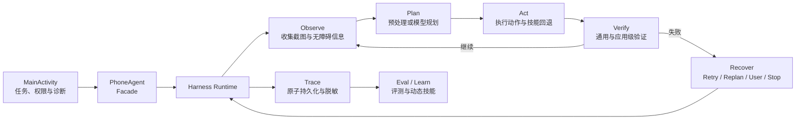

# PhoneAgent

> 一个运行在 Android 设备上的 AI 手机操作代理：读取当前界面、规划下一步、执行系统操作，并对结果进行验证、追踪和恢复。

[](https://developer.android.com/)
[](https://kotlinlang.org/)
[](LICENSE)

PhoneAgent 通过 Android `AccessibilityService` 执行点击、输入、滑动、返回、启动应用等操作，并可结合 `MediaProjection` 截图让多模态模型理解屏幕。项目当前的核心不再是一个不可见的提示词循环，而是一套可观察、可验证、可恢复、可评测的 **Harness Runtime**。

> [!WARNING]
> 本项目仍处于实验阶段，仅建议用于研究、学习和受控设备测试。无障碍服务、屏幕录制和悬浮窗权限能够接触屏幕内容并控制设备，请勿用于未经授权的设备、账号或高风险交易。

## 核心能力

- **三种观察模式**：无障碍、视觉、混合模式，按任务在结构化界面信息与截图之间取舍。
- **多模型接入**：内置 MIMO、Ollama、OpenAI、Anthropic、Gemini、Qwen、GLM，并支持自定义 OpenAI 兼容端点。
- **完整操作集合**：支持应用启动、点击、文本输入、滑动、滚动、拖拽、长按、双击、系统按键、等待和剪贴板读写。
- **Harness 执行闭环**：每一步都经过 `Observe → Plan → Act → Verify`，而不是只假设动作已经生效。
- **结构化故障恢复**：模型、观察、权限、执行、验证、应用启动和用户介入等失败会映射为明确的 `FailureType`，再路由到重试、重规划、用户接管或停止。
- **安全的人机协作**：验证码、登录、支付、隐私授权和不确定选择可通过 `Ask_User` 暂停任务并请求用户确认。
- **任务追踪与诊断**：记录步骤状态、动作前后观察、验证结果、耗时、模型用量、恢复决策和终止原因；支持搜索、清理和脱敏导出。
- **回归评测**：支持离线 Trace 评测与主动评测，用可重复的 case 检查成功率、步数和验证通过率。
- **技能与快捷任务**：内置应用别名、应用操作建议、提示卡和任务快捷方式，并能从示教 Trace 中沉淀动态路径技能。
- **异常中断续跑**：应用重启后可识别被中断的任务，通过新会话关联旧 Trace，并强制重新观察屏幕后再继续。

## 工作原理



`agent/PhoneAgent.kt` 只负责把界面层与运行时连接起来。任务循环及其状态由 `harness/runtime` 管理，观察、规划、执行、验证、追踪、评测和恢复分别由对应的 harness 分层负责。

## 环境要求

- Android 8.0（API 26）或更高版本
- Android Studio（建议使用内置 JDK 17）
- Android SDK 34
- 一台真机或模拟器；真机更适合验证无障碍、悬浮窗和跨应用操作
- 一个可访问的模型 API，或运行中的 Ollama 服务

项目使用 Gradle Wrapper，无需单独安装 Gradle。当前构建基线为 Gradle 8.11.1、Android Gradle Plugin 8.9.2、Kotlin 1.9.20。

## 快速开始

### 1. 获取项目

```bash
git clone https://github.com/RinFrrn/PhoneAgent.git
cd PhoneAgent
```

也可以在 Android Studio 中选择 **Get from VCS**，填入仓库地址后直接打开。

### 2. 构建并安装 Debug 版本

使用 Android Studio 连接设备后点击 **Run**，或者执行：

```bash
./gradlew assembleDebug
adb install -r app/build/outputs/apk/debug/app-debug.apk
```

如果设备上已安装使用不同签名构建的同包名应用，需要先手动卸载旧版本；卸载会清除该应用的本地配置和任务 Trace。

### 3. 配置模型

打开 PhoneAgent，进入 **模型设置**，新增或选择一个模型配置，然后填写：

- 服务商
- API 地址
- 模型名称
- API Key（服务商需要时）
- Temperature 与 Top P（可选）

建议为视觉或混合模式选择支持图片输入的多模态模型。应用会在任务开始前显示模型与运行模式的适配提示。

#### 在真机上连接 Ollama

Android 真机中的 `127.0.0.1` 指向手机自身，并不是开发电脑。可任选一种方式：

```bash
# USB 调试连接时，将手机的 11434 端口反向映射到电脑
adb reverse tcp:11434 tcp:11434
```

然后在应用中使用 `http://127.0.0.1:11434/v1`。也可以让 Ollama 监听局域网地址，并把 API 地址改为电脑的局域网 IP；使用局域网方式时请自行限制访问范围。

### 4. 授权必要权限

首次运行时按主界面的引导完成权限配置：

| 权限 | 用途 | 何时需要 |
| --- | --- | --- |
| 无障碍服务 | 读取结构化界面并执行点击、输入、滑动等操作 | 所有模式 |
| 悬浮窗 | 后台运行时显示状态、问题与用户接管入口 | 所有模式 |
| 屏幕录制 | 通过 MediaProjection 获取屏幕截图 | 视觉、混合模式 |
| 通知 | 显示前台任务状态 | Android 13+ |
| 麦克风 | 语音输入任务描述 | 可选 |

屏幕录制权限不会在应用启动时立即请求，只会在视觉或混合模式开始任务时请求。

### 5. 执行任务

1. 选择 **无障碍 / 视觉 / 混合** 模式。
2. 输入清晰、可验证的任务目标，例如“打开设置并进入蓝牙页面”。
3. 点击 **开始**，通过执行日志或悬浮窗查看当前阶段。
4. 如果应用请求确认、验证码或候选项选择，请明确回答后再继续。
5. 在 **最近任务** 或任务日志页面查看步骤 Trace、验证结果和失败原因。

模式选择建议：

| 模式 | 输入给模型的界面信息 | 适合场景 |
| --- | --- | --- |
| 无障碍 | 控件、文本、坐标等结构化内容 | 表单、设置页、文本列表；速度快、成本低 |
| 视觉 | 屏幕截图 | 图标、图片、画布、自绘控件或无障碍树不完整的界面 |
| 混合 | 截图 + 结构化内容 | 信息复杂或需要更强容错的任务，模型输入也更大 |

## 支持的模型服务商

| 服务商 | 默认端点 | 默认模型 | API Key |
| --- | --- | --- | --- |
| MIMO（小米 AI） | `https://api.xiaomimimo.com/v1` | `mimo-v2-pro` | 需要 |
| Ollama | `http://127.0.0.1:11434/v1` | `deepseek-v3.1:671b-cloud` | 不需要 |
| OpenAI | `https://api.openai.com/v1` | `gpt-4o` | 需要 |
| Anthropic | `https://api.anthropic.com/v1` | `claude-3-5-sonnet-20241022` | 需要 |
| Google Gemini | `https://generativelanguage.googleapis.com/v1beta` | `gemini-pro-vision` | 需要 |
| Qwen | `https://dashscope.aliyuncs.com/compatible-mode/v1` | `qwen-vl-max` | 需要 |
| GLM | `https://open.bigmodel.cn/api/paas/v4` | `glm-4.5v` | 需要 |
| 自定义 | 自行填写 | 自行填写 | 取决于端点 |

默认值来自当前代码配置，不代表模型一定可用或仍由服务商提供。实际使用前请以对应服务商的账户权限和 API 文档为准。

## Harness 架构

```text
app/src/main/java/com/mobileagent/phoneagent/
├── MainActivity.kt                 # 主界面、权限、任务入口与运行诊断
├── SettingsActivity.kt             # 多模型配置与拟人化执行设置
├── agent/
│   └── PhoneAgent.kt               # 对界面层提供的运行时 Facade
├── harness/
│   ├── runtime/                    # 任务循环、会话、状态与运行健康
│   ├── observe/                    # 截图和无障碍状态采集
│   ├── plan/                       # 模型规划、响应提取与任务预处理
│   ├── act/                        # 动作执行、拟人化与技能回退
│   ├── verify/                     # 通用验证、应用规则和敏感检查点
│   ├── recover/                    # FailureType 与结构化恢复策略
│   ├── trace/                      # Trace 持久化、检索、脱敏和统计
│   ├── eval/                       # 离线与主动回归评测
│   └── learn/                      # 示教记录与动态路径技能
├── action/                         # 动作类型、解析和 Android 执行适配
├── model/                          # 多服务商模型客户端与配置
├── service/                        # 无障碍、前台任务和悬浮窗服务
├── skill/                          # 内置应用技能和执行建议
├── shortcut/                       # 任务快捷方式
└── appcatalog/                     # 应用名与包名别名
```

更详细的设计资料：

- [Harness 总览](docs/harness/OVERVIEW.md)
- [故障类型与恢复语义](docs/harness/FAILURE_TYPES.md)
- [评测用例说明](docs/harness/EVAL_CASES.md)

## 动作协议

模型规划结果会被解析为结构化动作。常用动作包括：

| 类别 | 动作 |
| --- | --- |
| 应用与导航 | `Launch`、`Back`、`Home`、`press_key`、`key_event` |
| 触控 | `Tap` / `Click`、`Long Press`、`Double Tap`、`Swipe`、`Scroll`、`Drag` |
| 输入与数据 | `Type`、`Read_Clipboard`、`Write_Clipboard` |
| 运行控制 | `Wait`、`Finish`、`Answer`、`Note` |
| 人机协作 | `Ask_User`、`Take_over`、`Interact` |

触控坐标采用 `0–1000` 的归一化坐标，执行层会根据当前屏幕尺寸换算为实际像素。商业模型常见的动作别名和响应包装也会在解析层统一处理。

## Trace、验证与恢复

每个任务会生成独立会话，逐步保存：

- 动作前后的观察摘要
- 规划来源、动作和模型调用统计
- 执行结果、验证结果与应用级规则
- 各阶段耗时和运行健康警告
- 故障类型、恢复路由、尝试次数与原因
- 最终状态与可读结果

Trace 使用原子文件替换写入应用私有目录，并在落盘和导出前移除截图、API Key、敏感剪贴板内容等数据。任务日志页支持搜索、脱敏导出、历史索引检查和旧孤立文件清理。

## 开发与测试

运行 JVM 单元测试：

```bash
./gradlew testDebugUnitTest
```

检查 Debug 构建：

```bash
./gradlew assembleDebug
```

运行所有可用检查：

```bash
./gradlew check
```

新增运行时行为时，请遵循仓库的分层约定：

- 优先增加类型化字段，避免依赖字符串解析。
- 每条新失败路径都应映射到 `FailureType`。
- 每条新验证规则都应能在 Trace 中看到。
- 执行启发式优先放进 harness 对应层，不要把主逻辑继续堆进 `PhoneAgent`。

## 安全与隐私

- 只在你拥有或明确获准控制的设备与账号上使用。
- 不要让代理在无人监督下执行支付、发帖、删除数据或修改安全设置等不可逆操作。
- 模型请求可能包含当前屏幕截图或无障碍文本；使用第三方 API 前请确认其隐私政策。
- 模型 API Key 当前保存在应用私有的本地配置中；请使用权限受限的测试 Key，不要把 Key、签名密码或 Keystore 提交到 Git。
- 导出的日志虽会经过脱敏处理，分享前仍应人工检查。

## 常见问题

### 无法开始任务

先查看主界面的运行诊断，确认模型配置有效、无障碍服务已连接、悬浮窗已授权；视觉或混合模式还需要有效的屏幕录制授权。

### 模型请求失败

检查 API 地址、模型名、API Key、账户余额和网络连接。使用 Ollama 真机调试时，确认已经执行 `adb reverse` 或改用电脑的局域网 IP。

### 点击或滑动没有效果

查看该步骤的验证结果和 `FailureType`。无障碍节点坐标可能不完整，自绘界面也可能需要改用视觉或混合模式；运行时会对连续无效动作进行重规划或请求用户介入。

### 文本输入失败

先确认输入框已获得焦点。系统会尝试无障碍输入并提供剪贴板路径，但部分安全输入框、密码框和系统页面会主动禁止自动输入。

### 任务在应用重启后显示为中断

这是预期的安全策略。运行中的旧会话会被标记为 `RUNTIME_INTERRUPTED`；选择继续时会创建关联的新会话，并从新鲜的屏幕观察重新规划，不会直接重放旧坐标。

## 贡献

欢迎提交 Issue 和 Pull Request。建议为行为变更同时补充单元测试、Trace 可见字段和必要的评测用例。

```bash
git checkout -b feature/your-feature
./gradlew testDebugUnitTest
git commit -m "feat: describe your change"
```

## 致谢与许可证

本仓库基于 [MR-MaoJiu/PhoneAgent](https://github.com/MR-MaoJiu/PhoneAgent) 持续演进，当前版本重点建设 Harness Runtime、验证、追踪、评测和结构化恢复能力。

项目采用 [MIT License](LICENSE) 开源。
